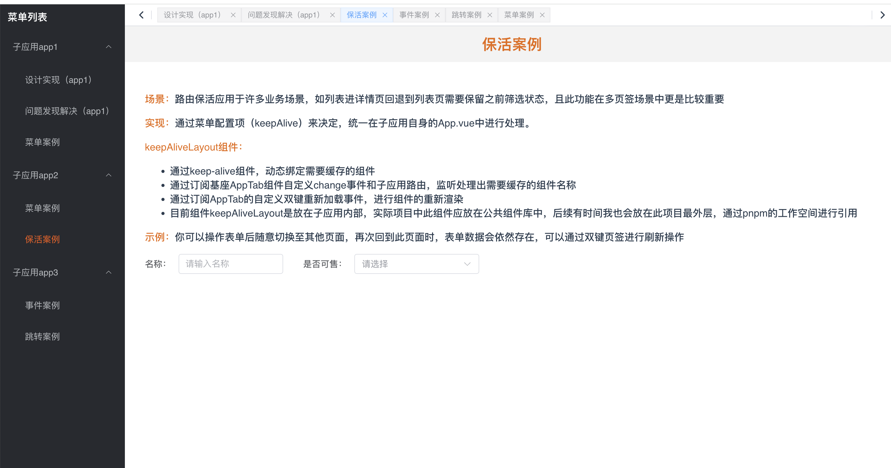

# 注意

未覆盖场景可以联系我

# 简介

micro-app-tabs举例了 `vue3` 如何作为主应用和子应用接入微前端，并在尽可能改动少量的代码的情况下做出尽可能完善的功能。

micro-app-tabs中所有项目都是使用官方脚手架创建的，它们足够精简，你完全可以将其中的demo作为基础进一步开发自己的项目。


# 目录结构
```
.
├── micro-app1           // 子应用1 vue3 (hash路由)
├── micro-app2           // 子应用2 vue3 (hash路由)
├── micro-app3           // 子应用3 vue3 (hash路由)
├── micro-base           // 主应用 vue3 (history路由)
├── package.json
└── pnpm-lock.yaml
```

# 开始

## 1、安装依赖

```bash
pnpm i
```


## 2、运行项目
node建议18,主应用监听了6070端口,而子应用端口各不相同，可以同时启动。

**1、启动 主应用 以及 所有子应用**

```bash
pnpm run start
```

访问：`http://localhost:6070/micro-base`


## 效果如下：



# 补充
- 1、如果你在安装依赖或启动项目时发生错误，可以尝试单独进入每个项目执行操作。
```bash
pnpm i
pnpm run dev
```
